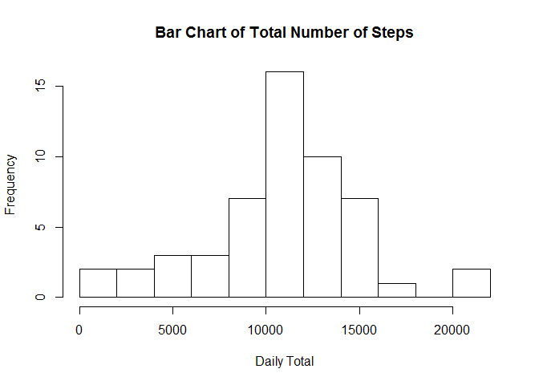
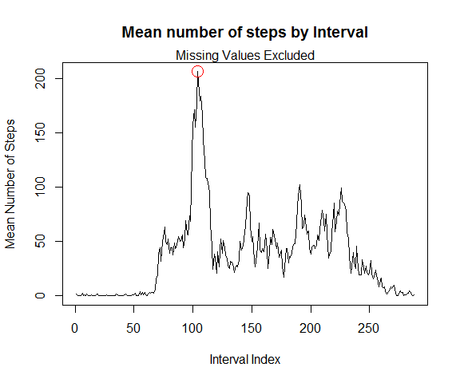
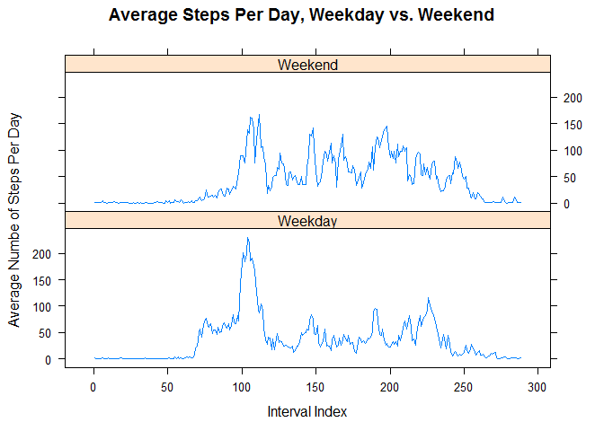
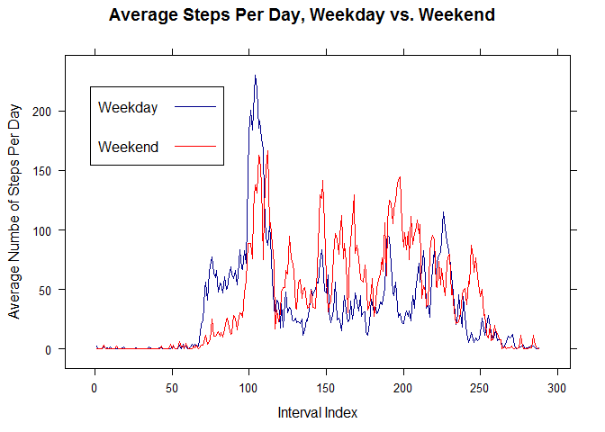

# Reproducible Research: Peer Assessment 1


## Loading and preprocessing the data


I start by setting a global option. This ensures that big numbers like 10,000 appear in regular, rather than scientific, notation.

```r
    options(scipen=100)
```

We load the data with the usual <tt>read.csv()</tt> function. By the way, I'm going to include some notes about using R and Markdown and HTML in my write-up. That's mostly for *my* benefit. Forgive me if it sounds like I'm trying to teach. 


I've found it useful to put my inline R code between `<tt>` and `</tt>` tags inside Markdown and HTML. (That's how I got the computer-style font I used for <tt>read.csv()</tt> above.) I learned that if you use HTML tags in Markdown, they're treated like HTML, but if you enclose them in backticks, they appear literally in the document. 

For the moment, we will keep all the missing values.


```r
    act <- read.csv ("activity.csv")
    print (dim (act)) # Take a look at the numbers of rows and columns.
```

```
## [1] 17568     3
```

## What is mean total number of steps taken per day?

The <tt>tapply()</tt> function is a natural here. We divide the "step" data into pieces according to the values in "date." Then  we apply the <tt>sum()</tt> function to each piece, passing the <tt>na.rm=T</tt> argument so as to ignore missing values. This line shows how the totals are computed -- I show only the first six results to save space.


```r
round (tapply (act$steps, act$date, sum), 1)[1:6]
```

```
## 2012-10-01 2012-10-02 2012-10-03 2012-10-04 2012-10-05 2012-10-06 
##         NA        126      11352      12116      13294      15420
```

The NA indicates that there was at least one misisng value in <tt>steps</tt> for 2012-10-01. In fact *every* entry on 2012-10-01 is NA. There are eight days on which every measurement is NA, and no NAs on any of the other days. If we passed the<tt>na.rm=TRUE</tt> argument into the <tt>sum()</tt> performed inside <tt>tapply()</tt>, we would end up with a bunch of zeros in our results that wouldn't reflect real measurements. If some days had some "real" values and some NAs, we would need to do something smarter, but in this data set we can just leave <tt>na.rm=FALSE</tt>, and our histogram will ignore the missing values computed by <tt>sum()</tt> 

Now we compute the mean and median of all the daily totals. We could do this separately, but <tt>summary()</tt> will provide both at once. Again, we don't omit the NAs from this computation, because each day is either all missing or all present.

The "extra" pair of parentheses around the second assignment below ensures that that result is printed out, as well as assigned. This way we can see that the result has elements named "Mean" and "Median". Next, we draw the bar chart. I have chosen to use about 10 bins for this picture. Technically, this isn't a "histogram," because it displays counts, not probability densities; there's been discussion about this in the forums.


```r
daily.totals <- tapply (act$steps, act$date, sum, na.rm=F)
(mysum <- summary (daily.totals))
```

```
##    Min. 1st Qu.  Median    Mean 3rd Qu.    Max.    NA's 
##      41    8841   10760   10770   13290   21190       8
```

```r
hist (daily.totals, 10, main = "Bar Chart of Total Number of Steps", xlab = "Daily Total", ylab = "Frequency")
```

 

The two values of interest -- the mean and median -- are visible in the output. Now I can insert them into my in-line Markdown. The mean daily number of steps, excluding  all NAs, is 10770, while the median is 10760. 
(I just typed <tt>r mysum["Mean"]</tt> between backticks inside RMarkdown to get that first result.) The histogram shows a more-or-less unimodal distribution -- a hump in the middle with decreasing tails -- and the fact that the mean and median are approximately equal suggests that the two tails aren't too terribly different. 

## What is the average daily activity pattern?
Here's another good use of </tt>tapply().</tt> This time we break the steps into pieces by "interval," and then compute the mean value of all entries with each specific value of interval. Then we draw the plot, and for a little extra excitement, add a red circle to indicate the highest point on the graph. This indicates the interval with the largest daily average number of steps. Notice that the numeric values of interval are not equally spaced. They go from 0 to 55 by 5, then 100 to 155 by 5, and so on. That makes it easy to figure out what time of day an interval corresponds to -- 1435, for example, is 2:35 p.m. -- but it means we probably don't want to plot those values, since there would appear to be a larger gap between 1450 and 1455 (a difference of 5) than between 1455 and the next value, 1500 (a "difference" of 45). Therefore it makes sense for the x-axis to be the numbers 1, 2, ... etc. instead of the interval values.


```r
intmeans <- tapply (act$steps, act$interval, mean, na.rm=T)
plot (intmeans, xlab = "Interval Index", ylab = "Mean Number of Steps",
      main = "Mean number of steps by Interval", type = "l")
mtext ("Missing Values Excluded")
#
# While we're here, let's find the largest y-value and the corresponding x.
#
largest.intmean <- max (intmeans)
largest.index <- which (intmeans == largest.intmean)[1] # the [1] breaks ties, if there is one
symbols (largest.index, largest.intmean, circles = 5, inches=FALSE, add=TRUE, fg="red")
```

 

```r
(winner <- act$interval[largest.index])
```

```
## [1] 835
```

Unsurprisingly, most intervals between around 10 p.m. and 6 a.m. involve few steps. The five-minute interval with the largest average number is the one with value 835. This is the interval from 8:35 to 8:40 a.m.


## Imputing missing values

 There are 2,304 missing values among <tt>steps</tt> observations, as this R code shows. Let's also count the number that
 are missing by day.


```r
sum (is.na (act$steps)) # total missing values
```

```
## [1] 2304
```

```r
table (tapply (act$steps, act$date, function (x) sum (is.na (x)))) # total number of NA's by day
```

```
## 
##   0 288 
##  53   8
```

Remember that there are 288 observations for each day (24 hours times 12 five-minute observations per hour). As we have seen already,  every observation is missing on each of eight days, and no other observations are missing. So our NA imputation strategy cannot use means or medians by day, since those numbers can't be computed. Instead we'll replace each missing observation by the average number of steps taken in that interval on days when it wasn't missing. Rather than over-write our <tt>act</tt> data frame, we'll make a copy and call it, I don't know, <tt>act2</tt>.

Here's my plan. Remember <tt>intmeans</tt>? It has names given by intervals, and values given by interval-specific means. We will take the set of interval values in <tt>act</tt> for which <tt>act\$steps</tt> is missing. We'll find the corresponding entry of <tt>intmeans</tt> by using <tt>match()</tt> to compare <tt>act\$interval</tt> to the names of <tt>intmeans</tt>, and where there's a match we'll pull out the numeric value of <tt>intmeans</tt>. That took longer to describe than it does to do!


```r
act2 <- act
act2$steps[is.na (act$steps)] <- intmeans[match (act$interval[is.na (act$steps)], names (intmeans))]
# Calculate interval means for the updated data, and compare to the results of the old calculation.
intmeans2 <- tapply (act2$steps, act2$interval, mean, na.rm=T)
summary (intmeans - intmeans2)
```

```
##    Min. 1st Qu.  Median    Mean 3rd Qu.    Max. 
##       0       0       0       0       0       0
```

Not surpringly, the new data set's interval means are no different from the old, because each missing day was given a complete set of the averages computed from the non-missing ones. Of course the day means for the non-missing days are unchanged as well.


## Are there differences in activity patterns between weekdays and weekends?

We answer this by first creating a vector that identifies each observation as being from a weekday or a weekend. The
<tt>date</tt> column is currently a factor, so we convert it to character, and then into a <tt>Date</tt> object. (If you're
new to R, trust me when I tell you that it's always a good idea to convert factors to character before doing anything else to them.)
Then we operate the <tt>weekdays()</tt> function on the result of that. This function produces a vector of day names. Finally,
<tt>act$Weekend</tt> is created as a logical vector, <tt>TRUE</tt> when the output of <tt>weekdays()</tt> is "Saturday" or "Sunday", and
<tt>FALSE</tt> otherwise. The <tt>is.element()</tt> function is useful here; we could have used <tt>%in%</tt> here as well.


```r
act2$Weekend <- is.element  (weekdays (as.Date (as.character (act2$date))), c("Saturday", "Sunday"))
table (act2$Weekend) # Make sure this seems reasonable; presumably it should be about 2/7 TRUE.
```

```
## 
## FALSE  TRUE 
## 12960  4608
```

Now we compute the average numbers of steps per day. As before, we use <tt>tapply()</tt>, but this time the
second argument is a list. The result of the call to tapply() is a 288 x 2 matrix, whose i-th row gives the
average number of steps for interval i on weekdays (where <tt>act$Weekend</tt> is FALSE) and then weekdays 
(where it is <tt>TRUE</tt>). 

Then we construct the data frame we'll use to plot. It has 576 rows, the results of the two sets of 288 being concatenated.
This data frame includes a column of indices, a column of the mean values we just computed, and a column marking the Weekend status.


```r
intmeans.wknd  <- tapply (act2$steps, list (act2$interval, act2$Weekend), mean, na.rm=T)
thing.to.plot <- data.frame (Index = rep (1:nrow(intmeans.wknd), 2),
                             Mean = c(intmeans.wknd[,"FALSE"], intmeans.wknd[,"TRUE"]),
                             Weekend = rep (c("Weekday", "Weekend"), each = nrow(intmeans.wknd)))
```

Now we're ready to plot. We attach the <tt>lattice</tt> library, then use <tt>xyplot()</tt>. The <tt>layout = c(1, 2)</tt>
put one plot on top of the other, instead of the default side-by-side; this lets our eye match up the x axes. 

In the second plot we put two lines on the same graph. Here we need to add a key, which requires a little work.


```r
library (lattice)
xyplot (Mean ~ Index | Weekend, data = thing.to.plot, type = "l", layout = c(1, 2),
        xlab = "Interval Index", ylab = "Average Numbe of Steps Per Day", 
        main = "Average Steps Per Day, Weekday vs. Weekend")
```

 

```r
xyplot (Mean ~ Index, data = thing.to.plot, type = "l", groups=Weekend, col = c("darkblue", "red"), 
        xlab = "Interval Index", ylab = "Average Numbe of Steps Per Day", 
        main = "Average Steps Per Day, Weekday vs. Weekend",
        key = list (x=.05, y= .9, border="black", padding.text = 8, 
                    text = list (c("Weekday", "Weekend")),
                    lines = list (lty = c(1, 1), col = c("darkblue", "red"))))
```

 

What we see here is that weekends have generally more activity throughout the day, although there's a little more activity, on average, in the early mornings on weekdays. This all makes intuitive sense. 


